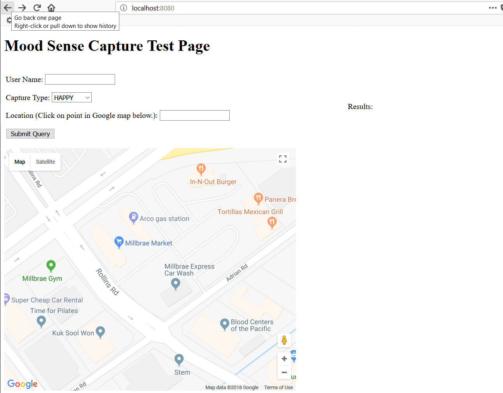

# moodsense
Mood Sensing Application

Hello, welcome to Nick Dierauf's Mood Sensing Application. Please review Mood-Sense-Development-Exercise.pdf for a complete explanation of the project.

To run the app, pull the source and compile as a .war file (mvn clean install). Drop the war file into a Java servlet container.

To test the app, navigate to the URL for this web application. 

